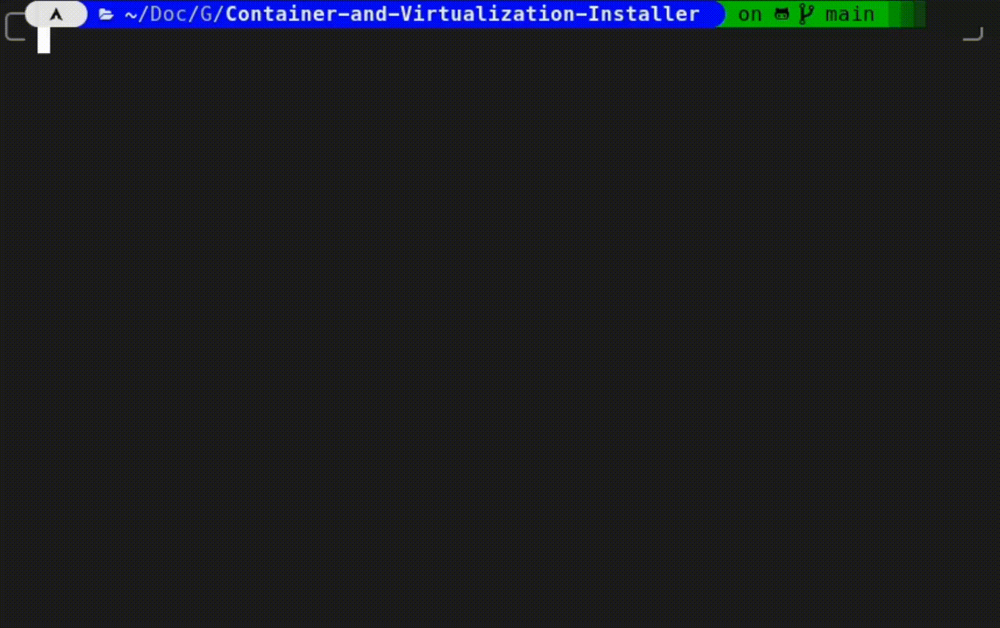

<h1 align="center">Virtualization and container applications installer 🖥️</h1>

###

<h4 align="center">An application that installs certain virtualization applications (Docker/Docker Desktop, VirtManager/QEMU, VirtualBox and Podman/Podman Desktop) on Linux via argument or command line user interface.</h4>

###

<div align="center">
  
  
</div>

###

<h2 align="left">Installation</h2>

###

<h2 align="center">Usage</h2>

###

<h3 align="left">With Argumants</h3>

```bash
--distribution <your_distro> #Default detect the your linux distro. If you want to another disto use this.
-a <action> #You select the action. <install> or <remove>. Default is install.
-o <output> #Hide or show terminal output. <silent> is hide the package manager and other outputs. <noisy> is show the terminal output. Default is <silent>.

#EXAMPLE
python app.py -a remove -o noisy <package_name> #This is a remove example.

python app.py -a remove -o noisy VirtualBox-7.0 Qemu_and_VM_Manager #You can use more than one package. Like this.
```

<p align="left">And one more thing. Arguments is case sensitive. You need the give in the packages name in the below!</p>

# Packages

<details><summary>Package Names</summary>

- Package names in the json and packages

    <details>

```json
  My_Apps
  VirtualBox-7.0
  Qemu_and_VM_Manager
  Docker_CLI_and_Docker_Desktop
  Podman_and_Podman_Desktop
```

</details>

###

<h3 align="left">With Command UI</h3>

###

<p align="left">Yep.....</p>

###

## Folder structure

```css
🗃 .
├── 🖿 assets
│  └── 🗋 preview images
├── 🖿 functions
│  ├── 🗋 __check_repository_connection__.py
│  ├── 🗋 __cli_dependencies_install__.py
│  └── 🗋 __get_os_package_manager__.py
├── 🖿 linux_distros
│  ├── 🗋 __arch__.py
│  ├── 🗋 __debian__.py
│  ├── 🗋 __fedora__.py
│  └── 🗋 __ubuntu__.py
├── 🖿 packages
│  └── 🗋 packages.json
├── 🖿 scripts
│  ├── 🗋 __arguments__.py
│  └── 🗋 __command_GUI__.py
├── 🗋 README.md
└── 🗋 app.py

```

<h2 align="center">Hakan İSMAİL 💙</h2>

###
